# Capstone Project - Azure Machine Learning Engineer Nanadegree Program
## Iris Classification

In this project, I used Iris dataset from UCI to perform classification using Azure ML service. Azure ML service provides 2 ways of doing this, these are:

- By using Azure AutoML: In this we give configuration of AutoML and datset and it will run many algorithms and feature engineering to find the best model. "automl.ipynb" contains code on how to do this.

- By using Azure hyperdrive: In this we choose an ML algorithm to run and different hyperparameters of that algorithm to tune, feed those to Hyperdrive configuration. Then it will run on combination of those based on the sampling method used. "hyperparameter_tuning.ipynb" contains code on how to do this.

## Project Set Up and Installation
This project requires access into the Azure ML studio. The following steps to be followed to initialize the project:

- Create a new workspace in Azure ML Studio, if haven't already.
- Create compute instance VM (inside Azure ML Studio) to run your juypter notebooks, if haven't already.
- All files, data is in the respository, download it.
- Upload it on the workspace.
- Register data on Azure ML Studio.
- All instructions how to run the cells are detailed in the notebooks.

## Dataset

### Overview
This is the iris dataset found in [UCI repository](https://archive.ics.uci.edu/ml/datasets/Iris). The iris plant has three species which we need to correctly classify. It contains 50 samples of each species totaling to 150 samples.

### Task
In this we perform classification task to corrctly predict class of iris plant. In this we used 4 features of plant i.e. sepal length (cm), sepal widt (cm), petal length (cm), petal width (cm).

### Access
To access data in workspace, first we need to register data in workspace and then we can access by **Dataset.get_by_name(ws, name='iris')** in notebook. Below is the image of registered dataset in Azure ML.
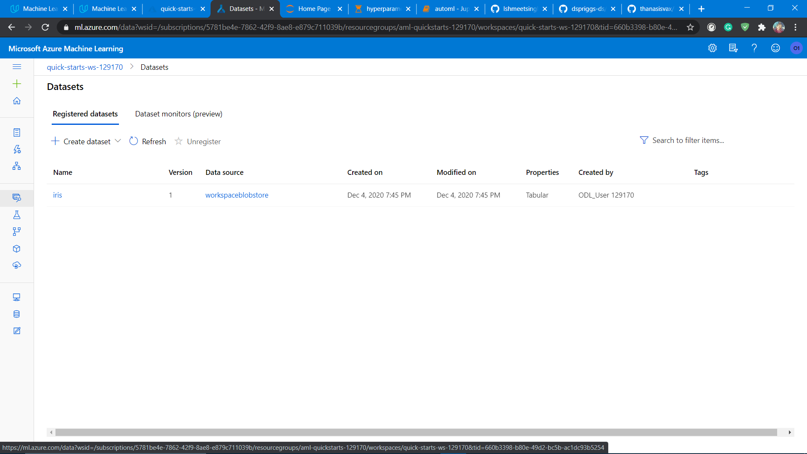

## Automated ML
Below are the settings used in AutoML:
- **experiment_timeout_minutes** is 15 as the data is very simple for the algorithm to understand and it does not require many models to run on.
- **max_concurrent_iterations** is 5 to run parallel runs.
- **task** is classification as it is a classification problem.
- **primary_metric** is accuracy as the accuracy will give correct results, as there is no data imbalancing problem.
- **training_data** is 'iris' which has 150 samples that will be used for training and validation.
- **label_column_name** is the iris class as the 'labels' is to be predicted.
- **n_cross_validations** is 5 to ensure that the model does not overfit over certain values.

### Results
The RandomForestClassifier was best model having accuarcy of 0.9667. Above has the details of AutoML parameters and below is the image.
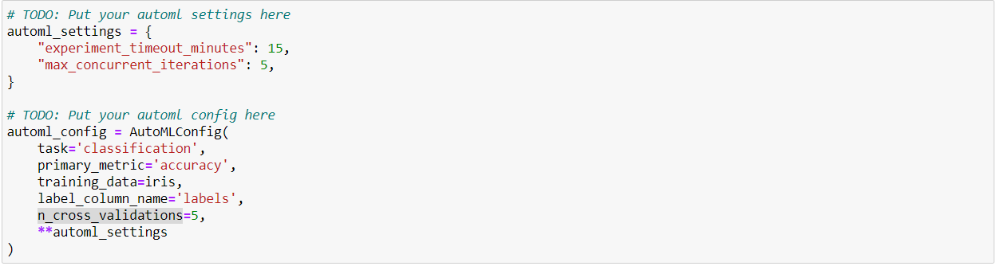
As this dataset was very easy for algorithm to learn patterns so by giving more time to AutoML it will surely give higher accuracy. The time was set to 15 minutes only.

- Below is the image of screenshot of RunDetails widget.
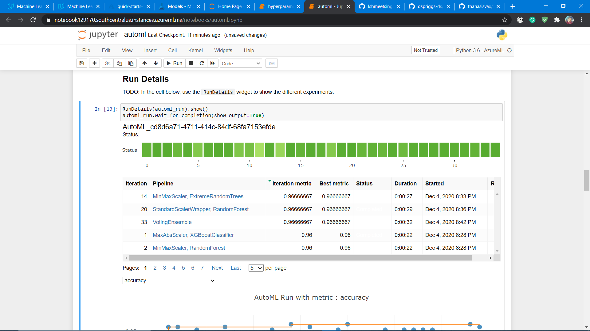

- Below is the screenshot of hyperparameters of best model of AutoML.
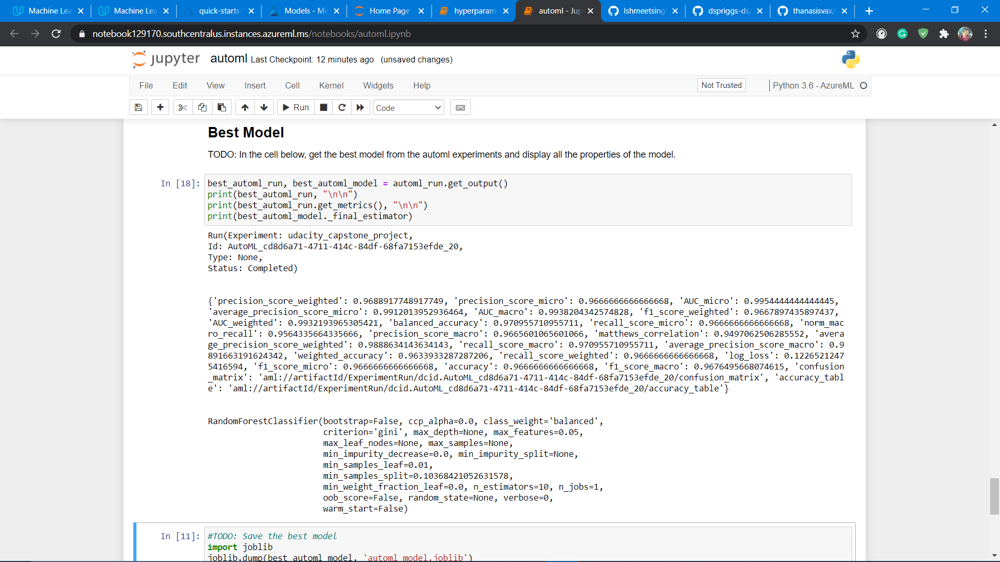

## Hyperparameter Tuning
I used sklearn logistic regression because the task was to solve a classification problem i.e. to predict class/species of iris plant. I choosed "C" and "max_iter" hyper-parameters of the logistic regression algorithm for optimisation. 

- C : This is the inverse regularization parameter. Regularization is the process in which the non significant features are penalised and their effect reduces based on the regularization strength. It’s a penalty term, meant to regulate against Overfitting.

- max_iter : Maximum number of iterations taken for the solvers to converge. As the algorithm runs and we don't know when it will converge hence we should give this to tune the algorithm.

I used RandomParameterSampling of these both hyper-parameters for the optimization of the logistic regression model. As for termination policy, I used BanditPolicy in which every two iterations checks if the primary metric i.e. accuracy falls outside the top 15% range.

### Results
The model got accuracy of 1 which is kind of expected as the data was very simple for algorithm to find patterns. The best model hyperparameters (that were tuned) are:
- C=0.403
- max_iter=50

In this case there is no improvement needed as it already has best result.

- Below is the image of RunDetails widget.
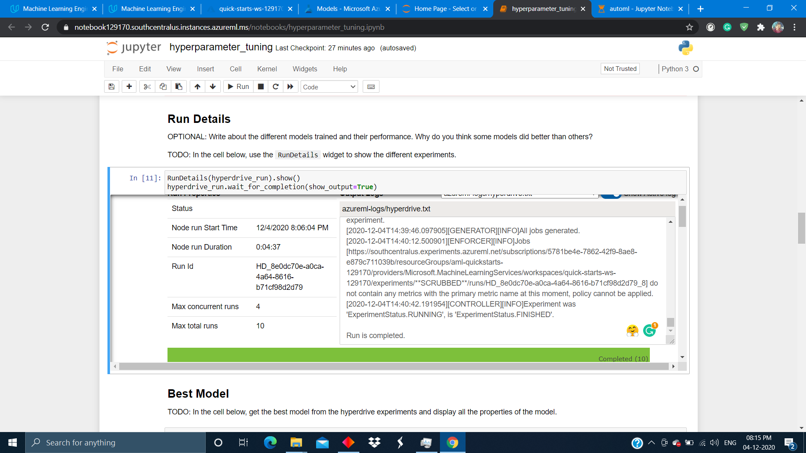

- Below is the parameters of best model.
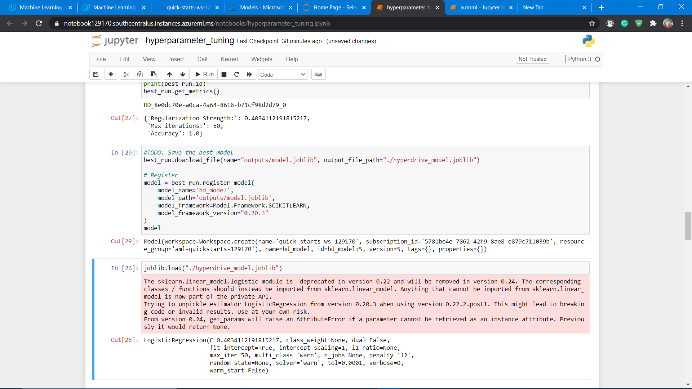

## Model Deployment
The best model was from hyperdrive with the accuracy of 1.0. Going forward with that we deployed it as a service on Azure. Below are steps to follow for deployment:

- Register the best model, in my case Hyperdrive.
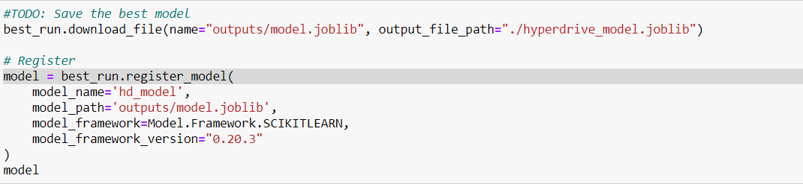
- Create inference config.
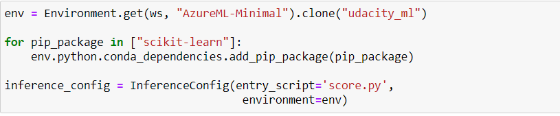
- Create any web service for deployment, in my case AciWebservice.
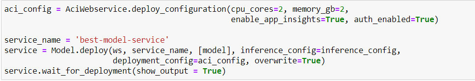
- Make dataset for query the web service.
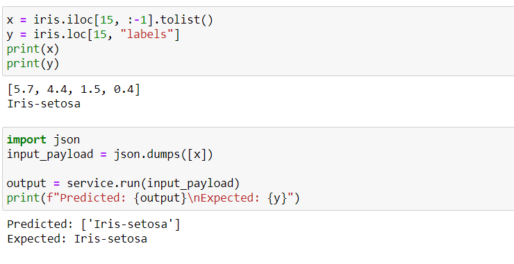

- Screenshot of my web service in healthy state and application insight is enabled.
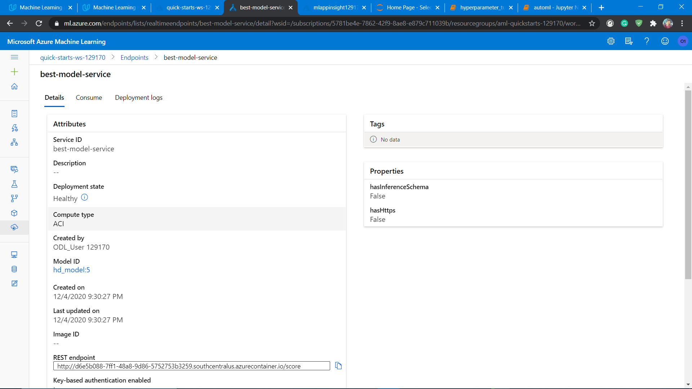
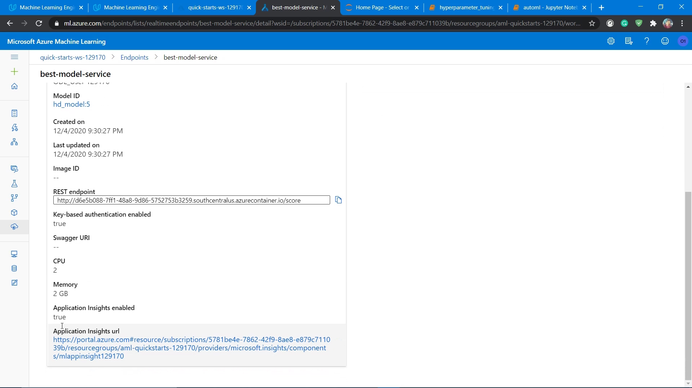

## Screen Recording
- If link is not working then, one can find video in repository in "video" folder. 
[Screencast link](https://drive.google.com/file/d/1kmDy8G8c_qpM9mR4XQCTebRkgWdrndh7/view?usp=sharing)